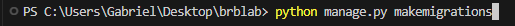

# Projeto BRB LAB

Projeto inicial para a criação do prototipo do sistema de checkin para o BRBLAB

## Requisitos Mínimos

* [Python](https://www.python.org/downloads/) versão 3.12.6 ou mais recente
* [Virtualenv](https://virtualenv.pypa.io/en/latest/installation.html) versão 20.29.1 ou mais recente
* [Git](https://www.git-scm.com/downloads) versão 2.45.1 ou mais recente
* [MySQL](https://dev.mysql.com/downloads/) instalado e configurado

## Configuração

### Em Windows

#### 1º Passo
Clone o repositório com o comando no seu terminal
```
git clone https://github.com/Gabrieldnb7/brb_lab.git
```

#### 2º Passo

Verifique se está com seu ambiente virtual (virtualenv) configurado e ativado dentro da pasta raiz do projeto. (Pode utilizar outro ambiente virtual se quiser).

Caso não saiba fazer isso, só seguir este guia: https://www.treinaweb.com.br/blog/criando-ambientes-virtuais-para-projetos-python-com-o-virtualenv. 
    
#### 3º Passo

Antes de prosseguir, tenha certeza que o ambiente virtual está ativado e que você está na pasta raiz do projeto no terminal como neste exemplo: 


Após isso, execute os seguintes comandos em seu terminal

```
pip install -r requirements.txt
``` 
Assim como está nesta imagem: 

Com isso, todas as dependências do projeto serão instaladas.

#### 4º Passo

Neste passo iremos carregar as primeiras configurações do nosso banco de dados e para isso começamos com o seguinte comando no terminal

```
python manage.py makemigrations
```
Assim como está nesta imagem: 

E o segundo comando que deve ser executado no terminal para que aplique as configurações é este:

```
python manage.py migrate
```
Assim como está nesta imagem: 

#### 5º Passo

Por fim, para iniciar a aplicação basta utilizar o seguinte comando no terminal:
```
python manage.py runserver
```
Assim como está nesta imagem: 

Após isso, acesse a aplicação por meio do link (http://127.0.0.1:8000) ou basta clicar no link na saída do terminal segurando a tecla CTRL do teclado como nesta imagem: 