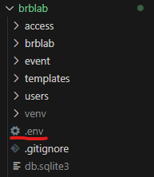

# Projeto BRB LAB

Projeto inicial para a criação do prototipo do sistema de checkin para o BRBLAB

## Requisitos Mínimos

* [Python](https://www.python.org/downloads/) versão 3.12.6 ou mais recente
* [Virtualenv](https://virtualenv.pypa.io/en/latest/installation.html) versão 20.29.1 ou mais recente
* [Git](https://www.git-scm.com/downloads) versão 2.45.1 ou mais recente
* [MySQL](https://dev.mysql.com/downloads/) instalado e configurado

## Configuração

### Pre-requisito do banco de dados
Tenha certeza que você criou uma conexão no seu MySQL Workbench com o nome "brblab" tudo junto e tudo minúsculo assim como no exemplo: 


E tenha certeza que tenha um schema com nome "brblab" criado dentro desta conexão assim como no exemplo:


Caso não tenha criado, basta adicionar o comando na aba de query do MySQL(A imagem explica):
```
CREATE SCHEMA brblab;
```
Assim como está na imagem: 


Observação: 
* O que está em vermelho abre a aba de query para digitação de códigos mysql
* O que está em azul é para executar a linha selecionada, para isso selecione com o mouse a linha onde você digitou o código e clique nesse icone do raio com o "I"

### No Windows

#### 1º Passo
Clone o repositório com o comando no seu terminal
```
git clone https://github.com/Gabrieldnb7/brb_lab.git
```

#### 2º Passo

Verifique se está com seu ambiente virtual (virtualenv) configurado e ativado dentro da pasta raiz do projeto. (Pode utilizar outro ambiente virtual se quiser).

Caso não saiba fazer isso, só seguir este guia: https://www.treinaweb.com.br/blog/criando-ambientes-virtuais-para-projetos-python-com-o-virtualenv. 


##### Passo adicional (Caso não tenha dado erro, desconsidere esse passo)

Caso você se depare com um erro da imagem a seguir (pode estar em português) que faz referência a permissão de execução, você deve fazer o que passarei a seguir.


Para resolver, utilize a pesquisa do Windows e digite Windows PowerShell como administrador assim como na imagem:


e em seguida utilizar este comando:
```
Set-ExecutionPolicy Unrestricted
```
E em seguida digite um "S" para aceitar as alterações, assim como está na imagem:


E isso deve resolver o problema
    
#### 3º Passo

Antes de prosseguir, tenha certeza que o ambiente virtual está ativado e que você está na pasta raiz do projeto no terminal como neste exemplo: 


Após isso, execute os seguintes comandos em seu terminal

```
pip install -r requirements.txt
``` 
Assim como está nesta imagem: 

Com isso, todas as dependências do projeto serão instaladas.

#### 4º Passo

Neste passo iremos configurar as variáveis de ambiente que é uma boa prática para não mandar informações sensiveis no código do projeto e para isso criaremos um arquivo ".env" dentro da pasta raiz do projeto assim como na imagem:



e dentro deste arquivo colaremos as seguintes informações:

```
SECRET_KEY = sua_secret_key
ALLOWED_HOSTS = localhost,127.0.0.1
DB_HOST = 127.0.0.1
DB_PORT = 3306
DB_USER = seu_usuario_mysql
DB_PASSWORD = sua_senha_mysql
```

E você irá mudar os campos SECRET_KEY, DB_USER, e DB_PASSWORD.
* SECRET_KEY: para gerar sua secret key é possível gerar ela por meio do comando
```
python -c "from django.core.management.utils import get_random_secret_key; print(get_random_secret_key())"
```
E assim gerará uma chave e mostrará no seu terminal, basta copiar e colar no campo de secret_key
* DB_USER: nome do usuário presente na conexão do workbench(por padrão é root)
* DB_PASSWORD: senha do seu MySQL workbench

#### 5º Passo

Neste passo iremos carregar as primeiras configurações do nosso banco de dados e para isso começamos com o seguinte comando no terminal

```
python manage.py makemigrations
```
Assim como está nesta imagem: 

E o segundo comando que deve ser executado no terminal para que aplique as configurações é este:

```
python manage.py migrate
```
Assim como está nesta imagem: 

#### 6º Passo

Por fim, para iniciar a aplicação basta utilizar o seguinte comando no terminal:
```
python manage.py runserver
```
Assim como está nesta imagem: 

Após isso, acesse a aplicação por meio do link (http://127.0.0.1:8000) ou basta clicar no link na saída do terminal segurando a tecla CTRL do teclado como nesta imagem: 

